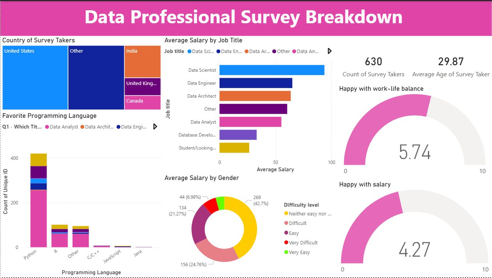

# 📊 Data Professional Survey Analysis Dashboard

## 📌 Project Overview
This project analyzes survey responses from data professionals across different roles, countries, and experience levels. The goal of the analysis is to uncover trends related to **salary distribution, job roles, programming language preferences, work-life balance, and job satisfaction** within the data industry.

The insights are presented through an interactive dashboard designed to help aspiring data professionals, recruiters, and organizations better understand the current data job landscape.

---

## 🎯 Objectives
- Analyze demographic distribution of data professionals globally
- Compare average salaries across different data roles
- Understand programming language preferences in the data industry
- Examine job satisfaction metrics such as work-life balance and salary satisfaction
- Present insights through a clear and intuitive dashboard

---

## 🗂 Dataset
- **Source:** Data Professional Survey (public dataset)
- **Records:** 630 survey responses
- **Key Attributes:**
  - Country
  - Job title
  - Gender
  - Age
  - Salary
  - Programming language preference
  - Work-life balance satisfaction
  - Salary satisfaction
  - Perceived difficulty of entering the data field

---

## 🛠 Tools & Technologies Used
- **Power BI** – Dashboard creation and data visualization  
- **Excel** – Initial data cleaning and preprocessing  
- **DAX** – Measures and calculated fields for analysis  

---

## 📈 Dashboard Features
The dashboard provides insights across multiple dimensions:

### 🌍 Demographics
- Country-wise distribution of survey participants
- Average age of data professionals

### 💼 Job & Salary Insights
- Average salary by job title
- Salary comparison by gender
- Distribution of roles such as Data Analyst, Data Scientist, Data Engineer, etc.

### 💻 Technical Preferences
- Most popular programming languages among data professionals
- Language preference across job roles

### 😊 Job Satisfaction
- Work-life balance satisfaction score
- Salary satisfaction score
- Perceived difficulty level of breaking into the data industry

---

## 🔍 Key Insights
- Data Scientist and Data Engineer roles show higher average salaries compared to other roles
- Python is the most widely used programming language among data professionals
- Work-life balance satisfaction is moderate, while salary satisfaction is comparatively lower
- The majority of respondents do not find entering the data field extremely easy or extremely difficult

---

## 📊 Dashboard Preview

## 🚀 Learnings & Takeaways
- Gained hands-on experience in cleaning and transforming survey data
- Learned how to build insightful KPIs using DAX
- Improved data storytelling through dashboard design
- Understood how survey data can be leveraged for career and industry insights

---

## 📌 Future Improvements
- Add slicers for experience level and education
- Perform deeper salary analysis using additional demographic factors
- Extend analysis using Python for exploratory data analysis (EDA)
- Compare trends across regions in more detail

---

## 👤 Author
**Sucharita Samantaray**  
Data Analyst | Computer Engineering Student  

📌 This project is part of my data analytics learning journey and portfolio.

